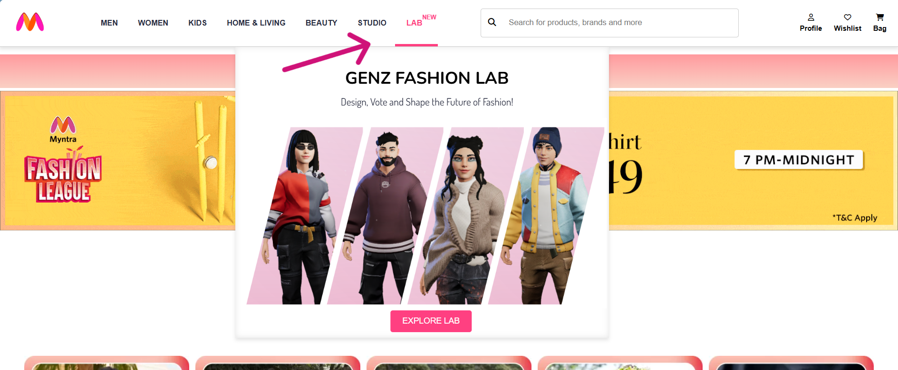
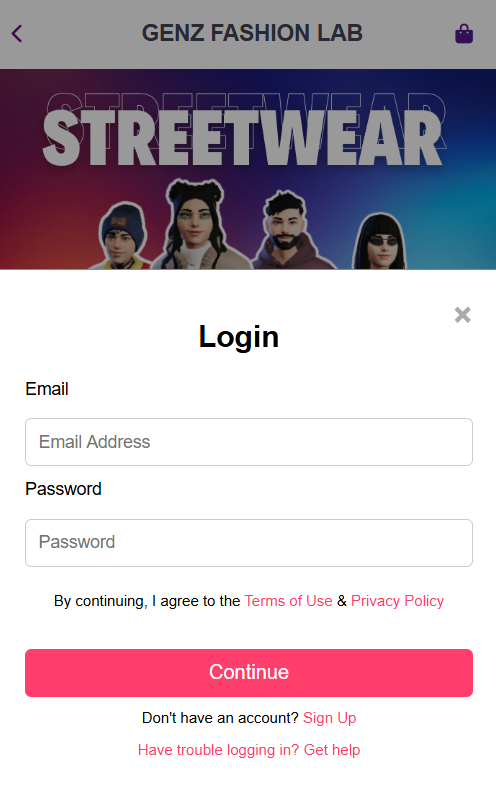
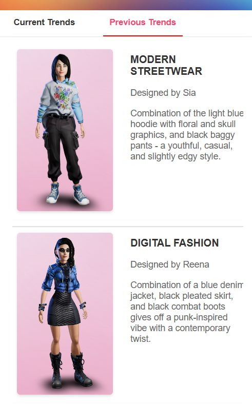

# The Gen Z FashionLab
A place to design, vote, and shape the future of fashion!

## Table of Contents

1. [Description](#description)
2. [How to Install and Run the Project](#how-to-install-and-run-the-project)
   - [Prerequisites](#prerequisites)
   - [Clone the Repository](#clone-the-repository)
   - [Setting up Database](#setting-up-database)
   - [Running the Server](#running-the-server)
3. [Key Features](#key-features)
4. [Walkthrough](#walkthrough)
5. [Tech Stack Used](#tech-stack-used)
   - [Frontend](#frontend)
   - [Backend](#backend)
   - [Additional](#additional)
6. [Future Scope](#future-scope)

## Description
Your voice matters! With the focus on co-creation our Fashion Lab allows users to be a part of the design process and gives them a space to share their designs, upvote and thus set the trends. It fosters a collaborative ecosystem where users can express themselves through Avatar Customization. Voting on user-generated designs grants them a voice in shaping future trends. The platform acts as a bridge between Gen Z and Myntra, providing invaluable insights into the ever-evolving preferences of this fashion-forward generation. Become a trendsetter, and watch your unique vision translate into real-world styles!
## How to install and Run the project
### Prerequisites
1. Install Python:  
   [Visit website](https://www.python.org/downloads/)

2. Install Django and additional libraries:
    ```console
    pip install django requests pygltflib numpy Pillow opencv-python scikit-image pandas

### Clone the Repository:
     ```console
       git clone https://github.com/vansheeekaaa/FashionLab.git
       cd FashionLab
   
### Setting up database:
    ```console
      python manage.py migrate

### Running the server:
     ```console
        python manage.py runserver

### Open your web browser and navigate to: 
  [http://127.0.0.1:8000/](http://127.0.0.1:8000/)
   (Ctrl + Click if using VSCode to open the link)


## Key Features
FashionLab introduces a dynamic "LAB" section within Myntra, where users engage in interactive design activities, vote on submissions, and curate their digital closets. Here's a glimpse of what awaits you:
- **Interactive Design Platform:** A seamless user experience for both exploring and creating fashion designs.
- **Custom Designing:** Experiment with various styles and options to create personalized avatars that reflect individual fashion preferences.
- **Personalized Closet:** A digital wardrobe where users can save, organize, and revisit their favorite designs for inspiration.
- **Gamified Experience:** Engage in gamified design challenges and activities that encourages creativity among users.
- **Trend Exploration:** Discover emerging fashion trends and styles through curated collections and user-generated content.

## Walkthrough
1. Navigate to navbar and select _LAB_ option
   
    

2. Login or SignUp

      
      

3. Explore the _New Theme_ announced and _Upvote_ your favourite designs and _Add them to your Closet_! 

      
      
      

4. Explore Recommendations for your favourite designs.

      

5. If you selected _PARTICIPATE_ - Get ready to showcase your talent. Think! Design! Submit!

   
   <span style="display: inline-block;">
       
   </span>
   <span style="display: inline-block;">
       
   </span>
   
6. Explore _MY CLOSET_ option

     
   
7. See and get influenced by Previous Trendsetters

    

## Tech Stack used
### Frontend:
- [HTML](https://developer.mozilla.org/en-US/docs/Web/HTML):  Used to provide the core structure and foundation of the user interface.
- [CSS](https://developer.mozilla.org/en-US/docs/Web/CSS):  USed for styling the user interface with layouts, colors, and interactive elements.
- [JavaScript](https://devdocs.io/javascript/): Used for adding interactivity and dynamic behavior to the user experience.
### Backend:
- [Python](https://docs.python.org/3/): Used for server-side logic.
- [Django Framework](https://docs.djangoproject.com/en/5.0/): A high-level framework used for handling various tasks like user authentication and database interaction.
### Additional:
- [ReadyPlayerMe](https://readyplayer.me/):  Used for Avatar creation.
- [sqlite3](https://www.sqlite.org/docs.html): Used for creating a database of Design submissions.
- [pandas]([https://www.sqlite.org/docs.html](https://pandas.pydata.org/docs/)): Used for processing data from CSV files.
- [requests]([https://www.sqlite.org/docs.html](https://pypi.org/project/requests/)): Used for making HTTP requests to fetch GLB files and images from URLs.
- [pygltflib]([https://www.sqlite.org/docs.html](https://pypi.org/project/pygltflib/)): Used for loading and parsing for extracting texture images from the GLB.
- [numpy]([https://www.sqlite.org/docs.html](https://numpy.org/doc/)): Used for numerical operations and array manipulations, for image processing.
- [Pillow]([https://www.sqlite.org/docs.html](https://pillow.readthedocs.io/en/stable/)): used for preprocessing images before comparison.
- [opencv-python]([https://www.sqlite.org/docs.html](https://docs.opencv.org/4.x/d6/d00/tutorial_py_root.html)): Used for resizing images and calculating color histograms.
- [scikit-image]([https://www.sqlite.org/docs.html](https://scikit-image.org/docs/stable/)): Used for measuring structural similarity between images, and for comparing image quality.

## Future Scope
This project holds immense potential for future development in various directions, promising to further revolutionize the fashion industry:
- **User-Imported Designs**: Users can upload their custom designs, which will be applied to the avatar in real-time, further empowering the users to bring their unique styles and creativity into the platform, providing a more personalized and engaging experience.
- **AR/VR Integration**: With the rise of AR/VR, a virtual try-on feature and virtual trial rooms can be implemented, further enhancing the user experience. 

---
This project is built as part of the Myntra Hackerramp Hackathon by _Team Valora_:
- Vanshika 
- Yashika Gupta
