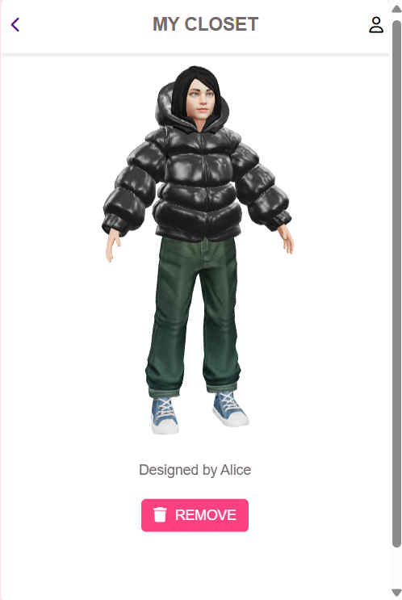

# The Gen Z FashionLab
A place to design, vote, and shape the future of fashion!

## Table of Contents
- [Description](#description)
- [How to install and Run the project](#how-to-install-and-run-the-project)
  - [Prerequisites](#prerequisites)
  - [Clone the Repository](#clone-the-repository)
  - [Setting up database](#setting-up-database)
  - [Running the server](#running-the-server)
  - [Open your web browser and navigate to](#open-your-web-browser-and-navigate-to)
- [Key Features](#key-features)
- [Walkthrough](#walkthrough)
- [Tech Stack used](#tech-stack-used)
  - [Frontend](#frontend)
  - [Backend](#backend)
  - [Additional](#additional)
- [Future Scope](#future-scope)

## Description
Your voice matters! With the focus on co-creation our Fashion Lab allows users to be a part of the design process and gives them a space to share their designs, upvote and thus set the trends. It fosters a collaborative ecosystem where users can express themselves through Avatar Customization. Voting on user-generated designs grants them a voice in shaping future trends. The platform acts as a bridge between Gen Z and Myntra, providing invaluable insights into the ever-evolving preferences of this fashion-forward generation. Become a trendsetter, and watch your unique vision translate into real-world styles!
## How to install and Run the project
### Prerequisites
1. Install Python:  
   [Visit website](https://www.python.org/downloads/)

2. Install Django:
    ```console
       pip install django

### Clone the Repository:
     ```console
       git clone https://github.com/vansheeekaaa/FashionLab.git
       cd FashionLab
  
### Setting up database:
    ```console
      python manage.py migrate

### Running the server:
     ```console
        python manage.py runserver

### Open your web browser and navigate to: 
  [http://127.0.0.1:8000/](http://127.0.0.1:8000/)
   (Ctrl + Click if using VSCode to open the link)


## Key Features
FashionLab introduces a dynamic "LAB" section within Myntra, where users engage in interactive design activities, vote on submissions, and curate their digital closets. Here's a glimpse of what awaits you:
- **Interactive Design Platform:** A seamless user experience for both exploring and creating fashion designs.
- **Custom Designing:** Experiment with various styles and options to create personalized avatars that reflect individual fashion preferences.
- **Personalized Closet:** A digital wardrobe where users can save, organize, and revisit their favorite designs for inspiration.
- **Gamified Experience:** Engage in gamified design challenges and activities that encourages creativity among users.
- **Trend Exploration:** Discover emerging fashion trends and styles through curated collections and user-generated content.

## Walkthrough
1. Navigate to navbar and select _LAB_ option
   
     
   
2. Chose from two options: _PARTICIPATE_ or _VOTE_
   
      
   
3. If you selected _PARTICIPATE_ - Get ready to showcase your talent. Think! Design! Submit!
   
   <span style="display: inline-block;">
       
   </span>
   <span style="display: inline-block;">
       
   </span>
   
4. If you selected _VOTE_ - Vote your favourite design and add it to your Closet.

     
   
5. Explore _MY CLOSET_ option

     
   
6. See and get influenced by previous trendsetters

    

## Tech Stack used
### Frontend:
- [HTML](https://developer.mozilla.org/en-US/docs/Web/HTML):  Used to provide the core structure and foundation of the user interface.
- [CSS](https://developer.mozilla.org/en-US/docs/Web/CSS):  USed for styling the user interface with layouts, colors, and interactive elements.
- [JavaScript](https://devdocs.io/javascript/): Used for adding interactivity and dynamic behavior to the user experience.
### Backend:
- [Python](https://docs.python.org/3/): Used for server-side logic.
- [Django Framework](https://docs.djangoproject.com/en/5.0/): A high-level framework used for handling various tasks like user authentication and database interaction.
### Additional:
- [ReadyPlayerMe](https://readyplayer.me/):  Used for Avatar creation.
- [sqlite3](https://www.sqlite.org/docs.html): Used for creating a database of Design submissions.

## Future Scope
This project holds immense potential for future development in various directions, promising to further revolutionize the fashion industry:
- **AI Integration**: The generated GLB files can be analyzed to get information regarding the most prominent design combinations, preferred colours, etc.
- **AR/VR Integration**: With the rise of AR/VR, a virtual try-on feature and virtual trial rooms can be implemented, further enhancing the user experience. 

---
This project is built as part of the Myntra Hackerramp Hackathon by _Team Valora_:
- Vanshika 
- Yashika Gupta 
